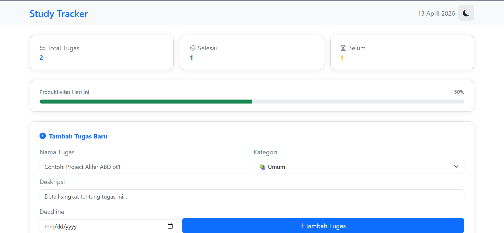
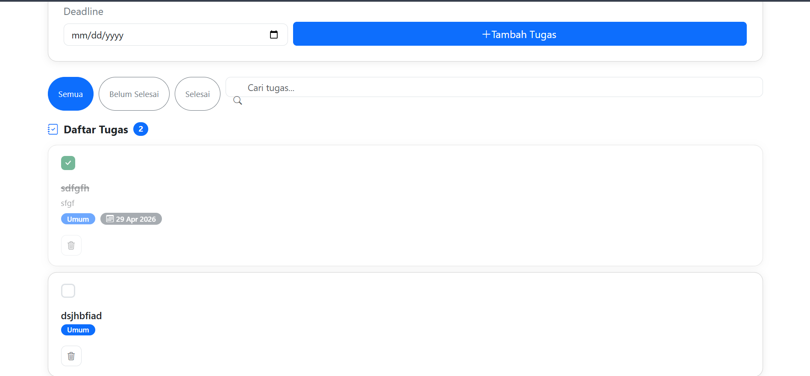
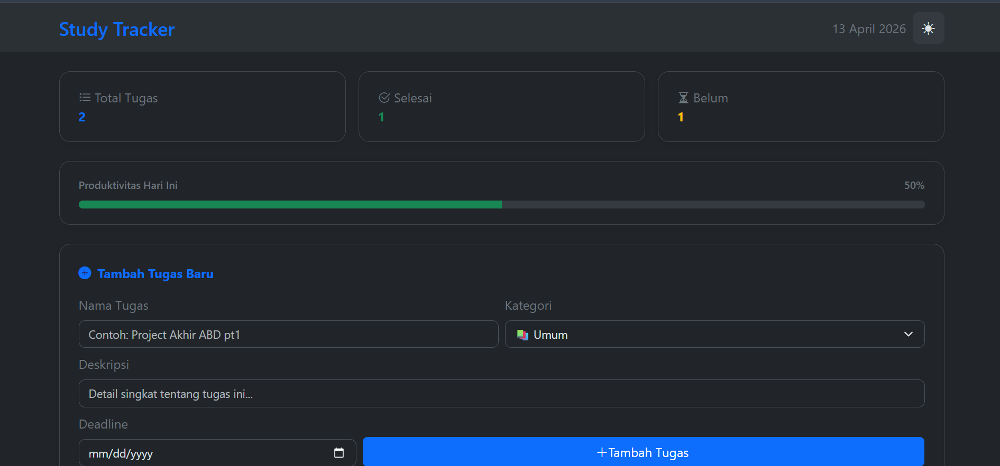

# 📚 StudyTracker

Aplikasi **to-do list** sederhana berbasis web yang dirancang khusus untuk membantu mahasiswa mencatat tugas harian, memantau progres belajar, dan melihat ringkasan produktivitas secara praktis.

---

## 🛠️ Teknologi yang Digunakan

| Teknologi | Keterangan |
|---|---|
| HTML5 | Struktur halaman |
| CSS3 | Styling kustom (layout, animasi, variabel) |
| JavaScript (Vanilla) | Logika aplikasi, manipulasi DOM |
| [Bootstrap 5.3](https://getbootstrap.com/) | Framework CSS — komponen & dark mode |
| [Bootstrap Icons 1.13](https://icons.getbootstrap.com/) | Library ikon |

---

## 🚀 Cara Menjalankan Aplikasi

### Langkah 1 — Clone atau unduh repositori Atau klik tombol **Code → Download ZIP**, lalu ekstrak.

### Langkah 2 — Pastikan struktur file seperti berikut

```
study-tracker/
├── index.html
├── style.css
├── app.js
└── README.md
```

### Langkah 3 — Buka di browser

Cukup buka file `index.html` langsung di browser (double-click), atau gunakan ekstensi **Live Server** di VS Code.

---

## 📸 Screenshot

### 🌤️ Light Mode



### 🌙 Dark Mode

